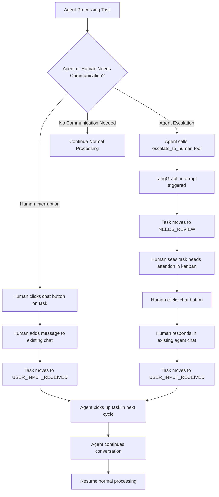

# Nova Human-in-the-Loop Architecture & Implementation Guide

## 📋 **Document Overview**

This document provides the complete architecture, technical specifications, and implementation work packages for adding bidirectional human-in-the-loop capabilities to Nova's core agent system.

**Version**: 2.0  
**Date**: June 6th, 2025  
**Status**: Design Phase - Ready for Implementation

---

## 🎯 **Executive Summary**

Nova's core agent will be enhanced with bidirectional human communication capabilities. Every task already has a core agent chat thread, and humans can view and interact with these chats directly. This creates a transparent, collaborative task processing system.

### **Key Benefits**
- **Transparent AI reasoning**: Humans can see exactly what Nova is thinking and doing
- **Bidirectional communication**: Agent can escalate OR human can interrupt anytime
- **Non-blocking operation**: Agent continues processing other tasks while waiting for human input
- **Unified interaction model**: Single chat interface replaces separate comment systems
- **Zero infrastructure changes**: Leverages existing LangGraph chat threads

---

## 🏗️ **System Architecture**

### **High-Level Flow**


### **Component Integration**

**Existing Components Leveraged:**
- Core agent LangGraph chat threads (one per task)
- Thread ID pattern: `f"core_agent_task_{task.id}"`
- Kanban lane system (NEEDS_REVIEW, USER_INPUT_RECEIVED)
- LangGraph interrupt/resume mechanism
- Frontend chat interface
- Task activities and summaries

**New Components:**
- `escalate_to_human` tool
- Chat button on every task in kanban
- Bidirectional communication handling
- Removal of task comments system

---

## 🔧 **Technical Specifications**

### **1. Database Schema**

**No database changes required** - leveraging existing core agent infrastructure:

```python
# Every task automatically gets a core agent chat thread via LangGraph
# Thread ID pattern: f"core_agent_task_{task.id}"
# No explicit chat_id needed - chat exists in LangGraph checkpointer

# Simplified task status flow:
# NEW -> IN_PROGRESS -> [communication] -> USER_INPUT_RECEIVED -> IN_PROGRESS -> DONE
# Where communication can be:
# - Agent escalation (moves to NEEDS_REVIEW first, then USER_INPUT_RECEIVED after human responds)
# - Human interruption (moves directly to USER_INPUT_RECEIVED)
```

### **2. Core Agent Tool**

```python
@tool
def escalate_to_human(question: str) -> str:
    """
    Ask the human a question about the current task.
    
    Use this when you need human input, approval, or decision-making.
    This will pause the current task and wait for human response.
    
    Args:
        question: Your question for the human. If this task already has an 
                 ongoing conversation, frame this as a follow-up question.
                 Otherwise, provide sufficient context for a new conversation.
                 
                 Examples:
                 - "Should I send this email draft to the client? [email content]"
                 - "I need approval to book the McKittrick Hotel for $200/night"
                 - "This task requires clarification: should I prioritize speed or accuracy?"
    
    Returns:
        The human's response/decision
    """
    # Implementation details in work packages below
```

### **3. Thread ID Pattern**

**Current pattern**: `f"core_agent_task_{task.id}"`
**Task ID extraction**: `task_id = thread_id.split("core_agent_task_")[1]`

### **4. Communication Mechanisms**

**Agent Escalation Flow:**
1. Agent calls `escalate_to_human` tool during processing
2. LangGraph interrupt triggered automatically
3. Task moves to `NEEDS_REVIEW` status
4. Human sees task in kanban, clicks chat button
5. Human responds in existing agent chat thread
6. Task moves to `USER_INPUT_RECEIVED`
7. Agent resumes conversation in next cycle

**Human Interruption Flow:**
1. Human clicks chat button on any task
2. Human adds message to existing agent chat thread
3. Task moves to `USER_INPUT_RECEIVED` status
4. Agent picks up and continues conversation
5. No special handling needed - just normal chat continuation

---

## 📦 **Work Package Breakdown**

### **WP1: Frontend Chat Integration**
**Priority**: High  
**Effort**: 2-3 hours  
**Dependencies**: None

**Tasks:**
- [ ] Add chat button to every task in kanban UI (next to delete button)
- [ ] Implement chat button click handler to open chat with task thread
- [ ] Handle human message posting to existing agent chat threads
- [ ] Auto-move task to USER_INPUT_RECEIVED when human posts message

**Deliverables:**
- Updated kanban task components with chat buttons
- Chat interface integration for task threads
- Visual styling for NEEDS_REVIEW tasks
- Message posting functionality

**Acceptance Criteria:**
- Every task has a clickable chat button
- Chat opens with correct core agent conversation thread
- NEEDS_REVIEW tasks are visually distinct
- Human messages trigger task status update

### **WP2: Core Agent Tool Implementation**
**Priority**: High  
**Effort**: 1-2 hours  
**Dependencies**: WP1 (for testing)

**Tasks:**
- [ ] Add `escalate_to_human` tool to `backend/tools/`
- [ ] Import and include tool in core agent tool list
- [ ] Handle LangGraph interrupt in core agent (move task to NEEDS_REVIEW)
- [ ] Test tool functionality with actual chat interface

**Deliverables:**
- `backend/tools/human_escalation_tool.py`
- Updated `backend/tools/__init__.py`
- Updated core agent tool list
- End-to-end testing with UI

**Acceptance Criteria:**
- Tool can be called by LangGraph agent
- LangGraph interrupt is triggered correctly
- Task moves to NEEDS_REVIEW status when tool is called
- Human can see and respond to escalation via chat UI

### **WP3: ~~Agent Resume Logic~~ ✅ ALREADY IMPLEMENTED**

**Status**: ✅ **COMPLETE** - No work needed!

The core agent already prioritizes `USER_INPUT_RECEIVED` tasks in `_get_next_task()`:
```python
# First, try USER_INPUT_RECEIVED tasks (oldest first)
result = await session.execute(
    select(Task)
    .where(Task.status == TaskStatus.USER_INPUT_RECEIVED)
    .order_by(Task.updated_at.asc())
    .limit(1)
)
```

**This means**:
- ✅ Tasks with human input are automatically prioritized
- ✅ Agent resumes conversation naturally via LangGraph thread
- ✅ No special resume logic needed - just normal task processing
- ✅ Human input becomes part of the ongoing conversation

### **WP4: API Endpoints**
**Priority**: Medium  
**Effort**: 1-2 hours  
**Dependencies**: WP1

**Tasks:**
- [ ] Create endpoint to get LangGraph chat messages for task thread
- [ ] Create endpoint to post human message to task thread
- [ ] Auto-update task status to USER_INPUT_RECEIVED on human message
- [ ] Add task filtering for NEEDS_REVIEW status
- [ ] Add API documentation

**Deliverables:**
- New API endpoints in `backend/api/api_endpoints.py`
- Integration with LangGraph checkpointer for chat retrieval
- Updated OpenAPI documentation

**API Specifications:**
```python
# GET /api/tasks/{task_id}/chat - Get LangGraph chat messages for task
# POST /api/tasks/{task_id}/chat/message - Post human message, update status
# GET /api/tasks?status=needs_review - Filter tasks needing decisions
```

**Acceptance Criteria:**
- API can retrieve LangGraph chat messages for any task
- Human messages are posted to correct task thread
- Task status automatically updates when human posts message
- Proper error handling for invalid task IDs

### **WP5: Testing & Refinement**
**Priority**: Medium  
**Effort**: 2-3 hours  
**Dependencies**: WP1, WP2, WP4

**Tasks:**
- [ ] Test end-to-end agent escalation flow
- [ ] Test human interruption of in-progress tasks
- [ ] Test multiple concurrent escalations
- [ ] Verify task status transitions work correctly
- [ ] Test chat interface with core agent conversations
- [ ] Performance testing with many active task chats

**Deliverables:**
- Comprehensive test suite
- Performance benchmarks
- User acceptance test scenarios
- Bug fixes and refinements

**Acceptance Criteria:**
- Agent escalation works from tool call to human response
- Human can interrupt any task and continue conversation
- Multiple escalations don't interfere with each other
- Task status flows work correctly
- Chat interface is responsive and intuitive

### **WP6: Chat Agent Integration** 
**Priority**: Low  
**Effort**: 30 minutes  
**Dependencies**: WP2

**Tasks:**
- [ ] Add `escalate_to_human` tool to chat agent tool list
- [ ] Test escalation from regular chat sessions
- [ ] Document usage patterns for chat agent escalations

**Deliverables:**
- Updated chat agent configuration  
- Basic testing of chat escalations
- Usage documentation

**Acceptance Criteria:**
- Chat agent can use escalation tool for sensitive operations
- Clear documentation on appropriate usage
- Tool works in both core agent and chat agent contexts

**Note**: Chat agent escalations work differently - they don't create tasks but can still use the interrupt mechanism for human oversight of sensitive operations.

---

## 🔌 **API Specifications**

### **New Endpoints**

#### **GET /api/tasks/{task_id}/chat**
Get LangGraph chat messages for a task's core agent conversation.

**Response:**
```json
{
  "task_id": "uuid",
  "thread_id": "core_agent_task_{uuid}",
  "messages": [
    {
      "role": "ai", 
      "content": "I'm starting work on this task...",
      "timestamp": "ISO timestamp"
    },
    {
      "role": "human",
      "content": "Wait, change the approach...",  
      "timestamp": "ISO timestamp"
    }
  ],
  "task_status": "needs_review"
}
```

#### **POST /api/tasks/{task_id}/chat/message**
Post a human message to task's chat thread and update task status.

**Request:**
```json
{
  "content": "Actually, let's prioritize the other approach instead",
  "author": "human"
}
```

**Response:**
```json
{
  "success": true,
  "task_status": "user_input_received", 
  "message": "Message posted, task queued for processing"
}
```

#### **GET /api/tasks?status=needs_review**
Filter tasks that need human decisions.

**Response:**
```json
{
  "tasks": [
    {
      "id": "uuid",
      "title": "Send client update email", 
      "status": "needs_review",
      "escalation_time": "ISO timestamp",
      "chat_id": "uuid"
    }
  ]
}
```

---

## 🧪 **Testing Strategy**

### **Unit Tests**
- `escalate_to_human` tool functionality
- Task ID extraction from thread_id
- Chat creation/update logic
- Resume processing logic

### **Integration Tests**
- End-to-end escalation flow
- Multiple concurrent escalations
- Task status transitions
- API endpoint functionality

### **User Acceptance Tests**
- Human escalation from core agent
- Human escalation from chat agent
- Frontend interaction flows
- Response and resume workflows

### **Performance Tests**
- Multiple simultaneous escalations
- Large task queues with escalations
- Chat history with many escalations
- Database performance under load

---

## 🚀 **Deployment Considerations**

### **Database Migrations**
- No schema changes required
- Existing relationships sufficient

### **Configuration Changes**
- Add `escalate_to_human` to tool lists
- No environment variable changes needed

### **Monitoring**
- Track escalation frequency
- Monitor task queue with NEEDS_REVIEW tasks
- Alert on tasks stuck in NEEDS_REVIEW status
- LangSmith tracing for interrupt/resume cycles

---

## 📚 **Implementation Guidelines**

### **Code Quality Standards**
- Follow existing Nova code patterns
- Maintain error handling consistency
- Add comprehensive logging for debugging
- Include type hints and docstrings

### **Error Handling**
- Graceful degradation when chat creation fails
- Timeout handling for stuck escalations
- Invalid task ID handling
- Human response validation

### **Security Considerations**
- Validate task ownership before escalation
- Sanitize human responses before agent processing
- Rate limiting on escalation endpoints
- Audit logging for human decisions

### **Performance Guidelines**
- Non-blocking escalation implementation
- Efficient chat message retrieval
- Minimal database queries for task resume
- Caching for frequently accessed escalation data

---

## 🎯 **Success Metrics**

### **Functional Metrics**
- [ ] Agent can successfully escalate questions to humans
- [ ] Humans can respond through chat interface
- [ ] Tasks resume processing after human input
- [ ] Multiple concurrent escalations work correctly
- [ ] No blocking of other task processing during escalations

### **Performance Metrics**
- Escalation creation time < 1 second
- Task resume time < 2 seconds
- No degradation in normal task processing speed
- Chat interface response time < 500ms

### **User Experience Metrics**
- Clear visual indicators for tasks needing decisions
- Intuitive response interface
- Task context clearly visible in chat
- Easy navigation between kanban and chat

---

## 📝 **Risk Assessment & Mitigation**

### **Technical Risks**
- **Risk**: LangGraph interrupt not working correctly
- **Mitigation**: Comprehensive testing with mock scenarios, fallback error handling

- **Risk**: Task resume logic failing
- **Mitigation**: Robust error handling, logging, manual task restart capability

- **Risk**: Chat synchronization issues
- **Mitigation**: Database transactions, optimistic locking, conflict resolution

### **User Experience Risks**
- **Risk**: Users missing escalation notifications
- **Mitigation**: Clear visual indicators, potential future notification system

- **Risk**: Context loss in chat interface
- **Mitigation**: Task linking, clear escalation message formatting

### **Performance Risks**
- **Risk**: Database performance with many escalations
- **Mitigation**: Efficient queries, indexing on task status, monitoring

---

## 🔄 **Future Enhancements**

### **Phase 2 Potential Features**
- Real-time notifications for escalations
- Escalation priority levels
- Multiple human approvers
- Escalation templates and forms
- Analytics dashboard for human decisions
- Mobile-friendly escalation interface

### **Advanced Capabilities**
- AI-powered escalation routing
- Learning from human decisions
- Escalation pattern recognition
- Automated approval for routine decisions

---

**This document serves as the complete implementation guide for Nova's human-in-the-loop functionality. Each work package can be implemented independently, allowing for iterative development and testing.** 